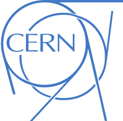

# Porting and Optimizing CLUE Reconstruction Algorithm With & Without Alpaka

> **This project has been conducted as part of my summer research program at CERN, The European Organization for Nuclear Research, in [CMS](https://cms.cern) experiment under the supervision of [Andrea Bocci]() and [Mario Gonzalez]().**

>This project focuses on the implementation and optimization of Sparse Matrix-Vector Multiplication (SpMV) on FPGAs using 
High-Level Synthesis (HLS). The goal is to evaluate different sparse matrix compression formats, analyze their performance in 
software and hardware environments, and implement an efficient SpMV accelerator targeting FPGA platforms.

**Contents:**

- 