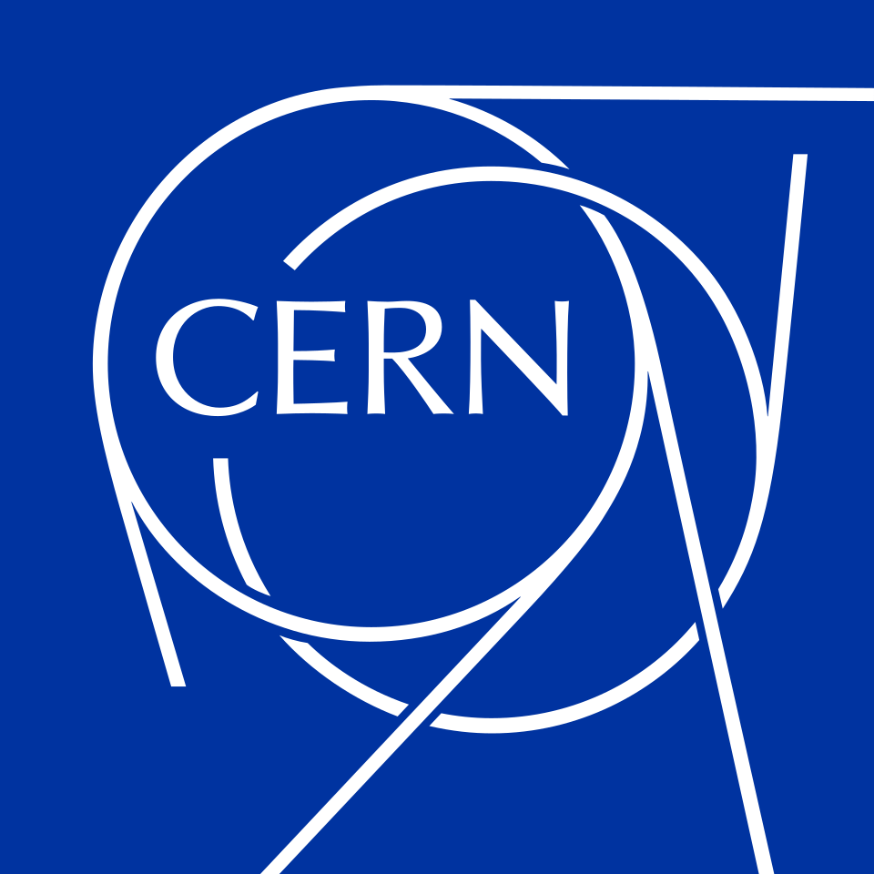

# Porting and Optimizing CLUE Reconstruction Algorithm With SYCL & Alpaka


> **This project was conducted as part of the Summer Student Programme at CERN within the [CMS](https://cms.cern) experiment by Ghala Buarish and Farid Abi Doumit, under the supervision of Andrea Bocci and Mario Gonzalez Carpintero.**

> This project focuses the porting and optimization of the CLUE clustering algorithm for FPGA acceleration in the CMS experiment. The work consists of two approaches, Intel oneAPI SYCL and Alpaka, with the goal of evaluating their suitability for FPGA execution. It includes adapting existing implementations, verifying correctness, analyzing performance, and comparing the resulting implementations in terms of performance and resource usage.


**Directories:**

- **CLUE-FPGA-Alpaka/** Alpaka-based implementation to adapt CLUE for FPGA execution. Passed emulation.
- **CLUE-FPGA-SYCL/** Intel oneAPI SYCL implementations used throughout the optimization process.
  - **First-Modification/** Initial FPGA-oriented modifications applied. Verified for correctness. Not fully optimized.
  - **Final-Pipelined/** Final optimized version focusing on pipelining. Verified for correctness. Fully optimized
  - **Final-Parallelized/** Alternative implementation exploring parallelization. Verified for correctness. Fully optimized.

## SYCL
### </> Compile and Run for Emulation 

```
icpx -fsycl -fintelfpga -DFPGA_EMULATOR main.cpp -I clueLib/include/ -o emulatorrun

time icpx -fsycl -fintelfpga -DFPGA_EMULATOR main.cpp -I clueLib/include/ -o emulatorrun

./emulatorrun -i data/input/aniso_1000.csv -d 7.0 -r 10.0 -o 2.0 -e 1 -v
```

### </> Compile and Run for Simulation

```
icpx -O2 -fintelfpga -DFPGA_SIMULATOR -Xstarget=B2E2_8GBx4 -Xssimulation -Xsboard-package=/data/CMS_CLUE/terasic/de10_agilex -Xsghdl -Xsparallel=48 main.cpp -I./clueLib/include -I./oneAPI-samples-2025.0.0/DirectProgramming/C++SYCL_FPGA/include -o cluestering_sim

./cluestering_sim -i data/input/aniso_1000.csv -d 7.0 -r 10.0 -o 2 -e 1 -v
```
## Alpaka
### </> Compile and Run for Emulation 

```
cmake -S . -B build -DCMAKE_BUILD_TYPE=Release -DCMAKE_CXX_COMPILER=icpx -Dalpaka_ACC_SYCL_ENABLE=ON -Dalpaka_SYCL_ONEAPI_FPGA=ON -Dalpaka_SYCL_ONEAPI_FPGA_MODE=emulation

cmake --build build --parallel

./build/fpgaclue_alpaka  -i data/input/aniso_1000.csv -d 7 -r 10 -o 2 -e 1 -u -v
```
